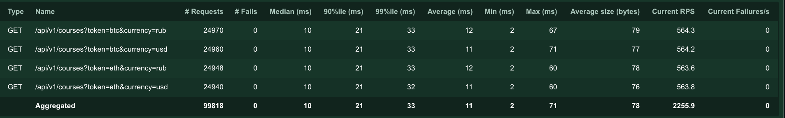

# Currency pairs

## How to run locally

1. Clone repository `git clone git@github.com:NikolayChernikov/CurrencyPairs.git`
2. Goto folder `cd CurrencyPairs`
3. Run service `docker-compose up -d`

## Linters

1. Flake8 `flake8 src`
2. Isort `isort src`
3. PyLint `pylint src`
4. MyPy `mypy src`

## Locust test
